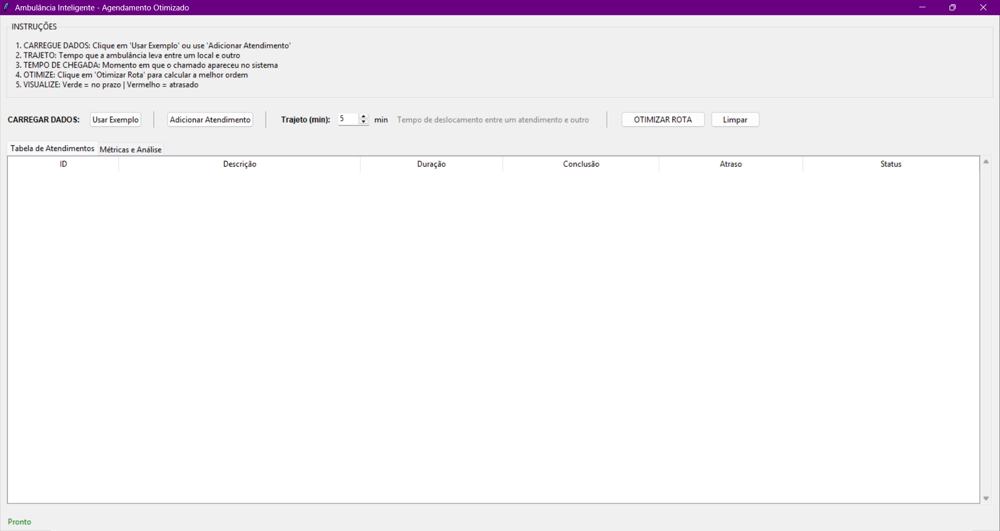
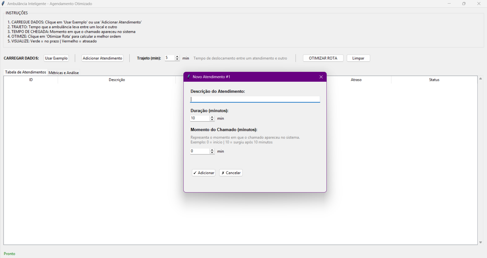
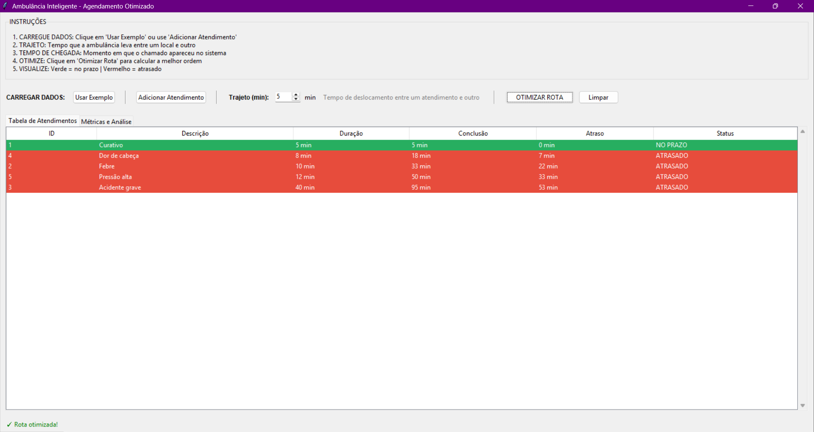
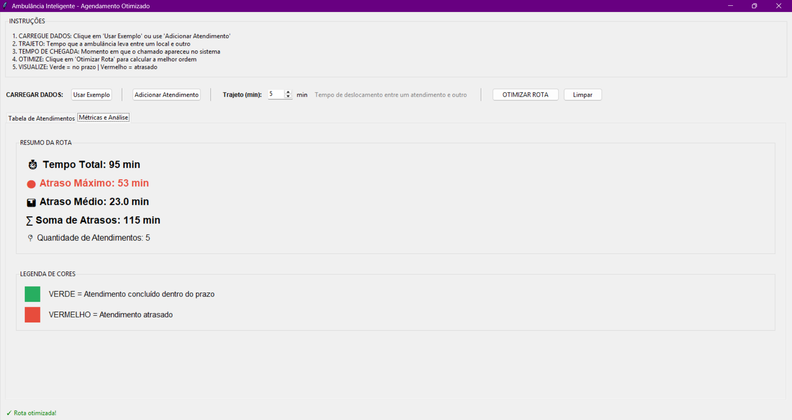

# Ambulância Inteligente 

Número da Lista: 22<br>
Conteúdo da Disciplina: Algoritmos de Ordenação<br>

## Alunos

| Matrícula | Aluno                            |
| --------- | -------------------------------- |
| 211061903 | Isaque Santos                    |
| 200023985 | Maria Eduarda dos Santos Marques |

---

## Sobre

Este projeto tem como objetivo simular um sistema inteligente de gerenciamento de atendimentos realizados por uma ambulância, buscando otimizar a ordem de execução dos chamados para minimizar o **atraso máximo** entre os atendimentos.

O sistema foi desenvolvido utilizando conceitos de ordenação, aplicando o algoritmo de **Atraso Máximo (Maximum Lateness Scheduling)** para definir a melhor sequência de atendimentos.

O problema considera:

- Chamados médicos com diferentes durações
- Tempo de deslocamento entre atendimentos
- Controle de atrasos
- Cálculo de métricas de desempenho

A solução foi construída utilizando:

- Estruturas de dados orientadas a objetos
- Algoritmos de ordenação implementados manualmente
- Interface gráfica com Tkinter
- Persistência de dados em JSON

O sistema funciona organizando os atendimentos em uma rota otimizada, onde:

- Cada atendimento possui informações como descrição, duração e momento do chamado
- A ambulância executa os atendimentos em sequência
- O sistema calcula o tempo de conclusão e o atraso de cada atendimento
- O algoritmo busca reduzir o maior atraso existente na rota

---

## Funcionalidades

- Adicionar atendimentos pela interface gráfica
- Ajustar tempo de trajeto entre pontos
- Carregar atendimentos de exemplo
- Executar otimização da rota
- Visualizar tempos de conclusão
- Calcular atrasos automaticamente
- Exibir métricas de desempenho
- Exportar rota otimizada para JSON

---

## Algoritmo Utilizado

O projeto utiliza o algoritmo de **Atraso Máximo**, cujo objetivo é minimizar o maior atraso entre todos os atendimentos realizados.

O cálculo considera:

```text
atraso = tempo_conclusao - prazo
```

Onde:

```text
prazo = momento_chamado + duracao
```

O sistema ordena os atendimentos buscando reduzir o impacto dos atrasos e melhorar o tempo geral de resposta da ambulância.

---
 
## Screenshots

# Tela inicial


# Tela de Novo Atendimento


# Tela de Otimizar Rota 


# Tela de Métricas e Análise


---

## Vídeo do trabalho

[Clique aqui para assistir à demonstração](https://youtu.be/wj6ZPyVY6Hk)

---

## Instalação

Linguagem: Python<br>

### Pré-requisitos

- Python 3.8 ou superior
- Tkinter instalado

---

## Passos para execução

Para executar o projeto:

```bash
cd G22_Greedy_PA-26.1 
```

```bash
python main.py
```
ou

```bash
python run_gui.py
```

---

## Passo a passo

1. O usuário adiciona os atendimentos informando:
   - ID
   - Descrição
   - Duração
   - Momento do chamado

2. O sistema permite configurar:
   - Tempo de trajeto entre atendimentos

3. Ao executar a otimização:
   - Os atendimentos são ordenados
   - A rota é calculada
   - Tempos de conclusão são gerados
   - Atrasos são identificados

4. O resultado é exibido com:
   - Ordem otimizada da rota
   - Tempo total
   - Atraso máximo
   - Atraso médio
   - Soma total dos atrasos
   - Status de cada atendimento:
     - NO PRAZO
     - ATRASADO

---

## Outros

### Organização do Projeto

O projeto foi dividido em módulos para melhor organização:

- `main.py` → inicia a interface gráfica  
- `run_gui.py` → execução alternativa da GUI  
- `src/models.py` → definição das classes `Atendimento` e `Rota`  
- `src/scheduling.py` → algoritmo de atraso máximo e cálculo de métricas  
- `src/gui.py` → interface gráfica em Tkinter  
- `src/utils.py` → leitura e gravação de arquivos JSON  

---
